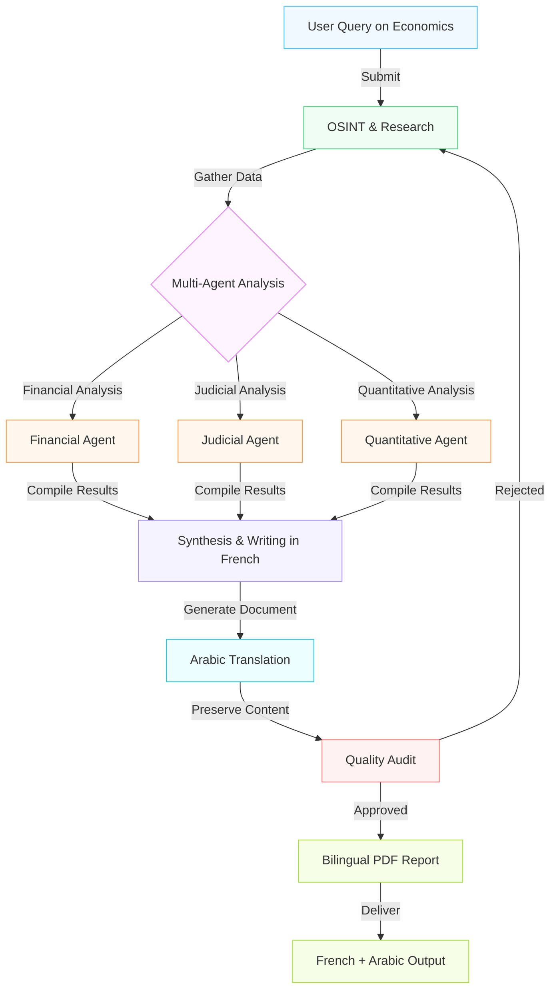
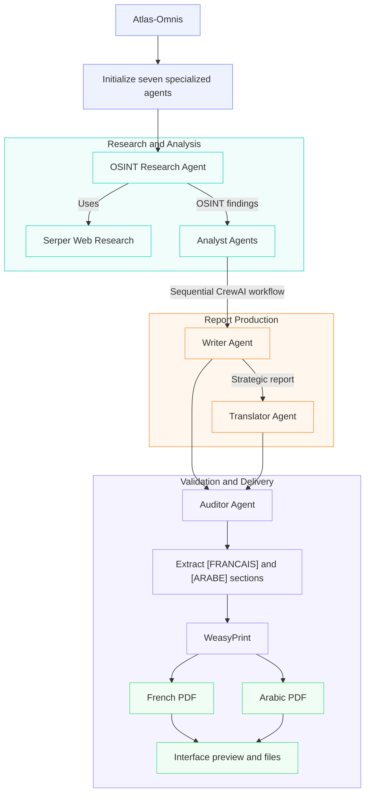

# The AtlasOmnis Firm

AtlasOmnis is an AI agent orchestration composed of seven "experts" each one with a specific specialization revolving around Moroccan and Global Economics. The goal is to produce two coherent detailed reports (same content just one in French the other in Arabic) on a specific topic about Economics or Econometrics.

## The Problem

Economics is a very complex field, which contains topics and questions that require immense reasoning. So, delegating a request containing these advanced concepts to one LLM, will produce poor outputs that only cover the surface of that specific topic. This explains the need of multiple LLMs or agents that cover different niches (i.e OSINT research, economic and legal analysis, strategic synthesis etc...) to produce together a detailed and rich document. And that is what AtlasOmnis is for. 

## AtlasOmnis Architecture

Atlas Omnis is composed of  7 different agents each with a specific goal and role. They all work together to produce the final bilingual reports, this diagram explains thoroughly the role of each agent and how they cooperate.

We use the CrewAI framework to orchestrate this process. We implemented the sequential process to avoid some earlier problems related to the hierarchical process, which boiled down to the manager doing all the work and not delegating tasks. The sequential process means that the agents work in order seen in the diagram, one by one. We chose the bilingual PDF output (French+Arabic) because those two languages are essential in the Moroccan MEF. 

## The Seven Agents

| Agent           | Role                          | Responsibility                                           |
| --------------- | ----------------------------- | -------------------------------------------------------- |
| Researcher   | OSINT & Economic research | Collects extensive and detailed contextual Moroccan data                 |
| Jurist       | Moroccan Legal Analyst           | Analyzes Moroccan laws and Dahirs                        |
| Statistician | Quantitative Analyst          | Develops KPIs and quantitative models                    |
| Financier    | Financial Analyst             | Analyzes financial, macro and microeconomic impacts             |
| Writer       | French Writer and summarizer       | Synthesizes the expert outputs into the strategic report |
| Translator   | Arabic Translator      | Translates the report into Classical Arabic              |
| Auditor      | Quality & Final Audit         | Checks and consolidates the final bilingual output       |

This table explains thoroughly the role and responsibility of each agent. The separation of tasks enable better outputs, since instead of forcing one agent to do all the responsibilities, we spread it out to 7 different agents to give more focus and attention to each niche.

## How a mission works

A **mission** is just the process of all the agents working together. As said before, a mission is sequential, which means the agents work one by one. This diagram will explain the mechanics of a **mission**:

## Intelligence Pipeline

The Osint Researcher agent is a core member of the firm. He is the only agent with the serper search tool, and that is to separate the ability to search, from the ability of analysis. And that is for the goal to allow each agent to only focus on one area, the researcher extracts copious amounts of information and context from the web around a specific topic, which is then transferred to each of the three analysts.

## Report generation

The Final Output is first translated by the translator to Arabic, then the html changes the format the PDF to RTL (right to left) and vice versa if in French. The auditor also puts specific tags in the final text for each language to make detection easier.

## Tech Stack 

This is our Tech stack for this project which is quite compact:

| Technology         | Why?                                                    |
| ------------------ | ------------------------------------------------------- |
| **Python**         | Core language for the entire system and agent logic     |
| **CrewAI**         | Orchestrates the specialized AI agents and workflows    |
| **Gemini 3 Flash** | Powers the AI reasoning, analysis, and generation       |
| **Serper**         | Provides fast, reliable web search for research         |
| **Gradio**         | Provides a simple interactive interface                 |
| **WeasyPrint**     | Generates polished PDF reports from the agents' outputs |

## Project Structure

We intentionally used one file since the projects code is compact and efficient. We have also included a specific font since it is compatible with both languages. In the future, when more features will be added, the architecture will be changed accordingly.

## User base

Atlas Omnis has been used by an Administrator in the MEF who reported increased efficiency and  detailed outputs compared to other LLMs, the user implemented Atlas Omnis in his workflow regarding banking, external finance and regulations.

## Limitations

The project includes many limitations across many features:
- There have been some problems with the formatting of the Arabic pdfs, where random characters appear in the middle of the text. This is occasional.
- LLM generated content isn't always correct, and hallucinations may happen
- Critical Legal and Economic conclusions always need human verification
- Research quality depends on the sources
- The Sequential process is expensive and slow
- The simulation is not in any way a replacement of real analysts and writers

## Future Ambitions

Near Term:

- Better Source verification
- More rigorous fact checking
- Agent cross-examination
- Better report formatting

Long Term:

- More specialized agents
- Using a faster and more efficient process
- Mission history
- More sophisticated simulation

## Thank You!

Thank you for checking out and reading my project, you are welcome to contribute and send me any suggestions.

Written by: Mohamed Amir Moutem
Age: 15
email: amirmoutem19@gmail.com
GitHub: I think you already know :)
